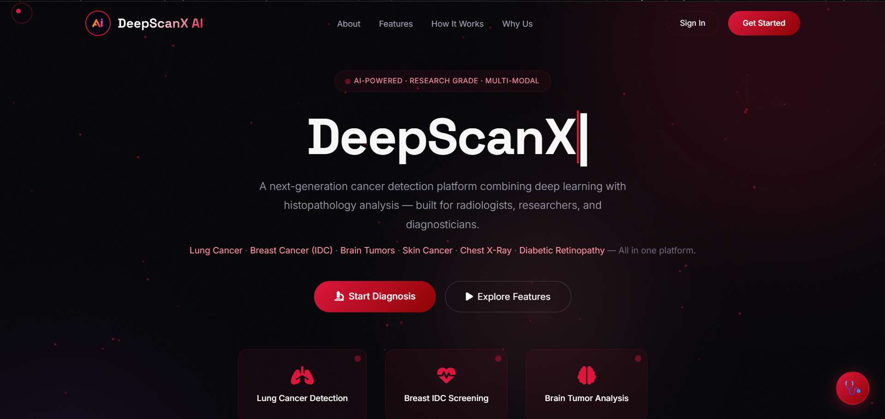
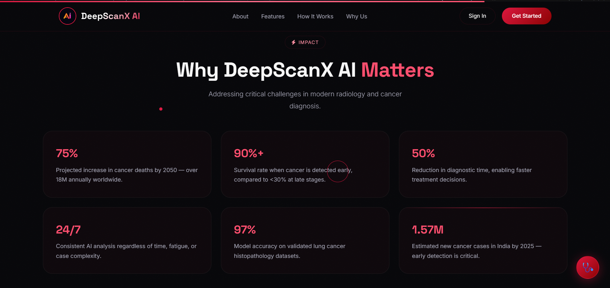
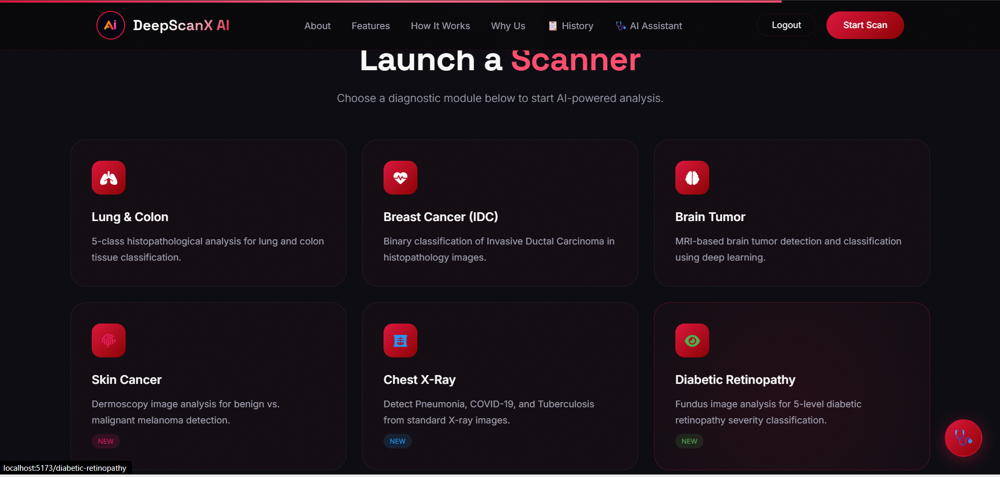
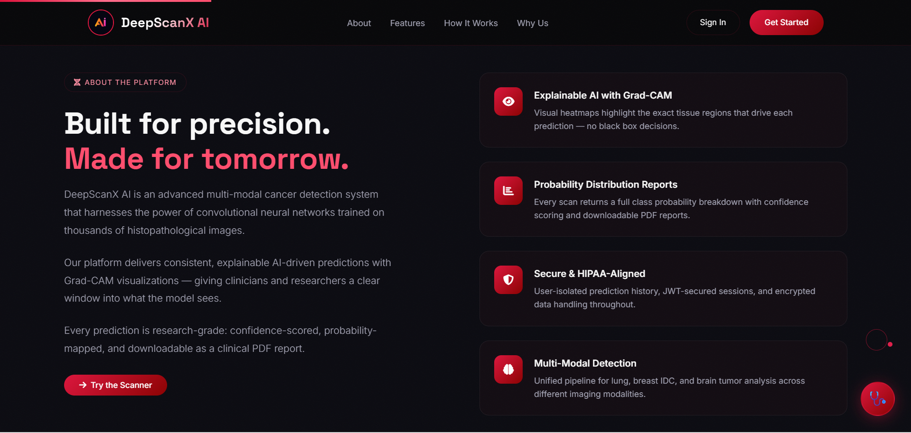
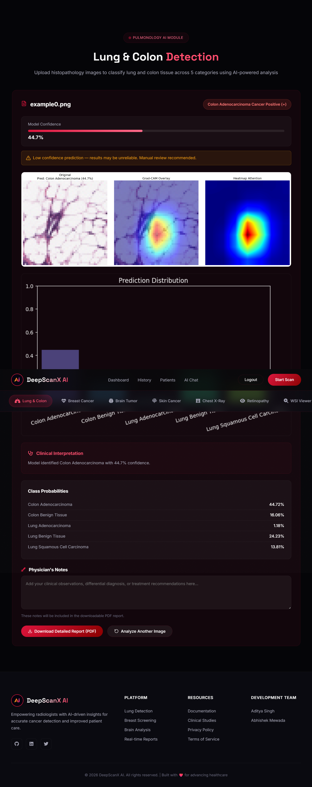

# 🔬 DeepScanX — Unified AI Radiology & Pathology Assistant

**Empowering Healthcare with Explainable Deep Learning for Early Cancer Detection**

DeepScanX is a state-of-the-art, modular medical imaging platform that combines modern web technologies with advanced neural networks. It provides clinicians, researchers, and medical students with a unified interface for the rapid assessment of histopathology and radiology images across 13+ specialized diagnostic modules.

<div align="center">
  
</div>

---

## ✨ Platform Preview

Experience the future of digital pathology and radiology through our intuitive, high-performance interface.

<div align="center">
  <table width="100%">
    <tr>
      <td width="50%"></td>
      <td width="50%"></td>
    </tr>
    <tr>
      <td align="center"><b>Intuitive Diagnostic Selection</b></td>
      <td align="center"><b>Advanced Clinical Analytics</b></td>
    </tr>
  </table>
</div>


---

## 🚀 Modern Architecture

DeepScanX has been re-engineered for performance, security, and scalability:

- **Frontend**: Modern **React 18** + **Vite** for a blazing-fast, responsive UI.
- **Auth & Database**: Powered by **Supabase** (PostgreSQL) for secure, real-time data and identity management.
- **AI Backend**: **Flask 3.1** serving high-precision **PyTorch** models (ResNet18, Ensembles).
- **Explainability**: Integrated **Grad-CAM** visualizations to help clinicians understand "why" a model made a prediction.
- **Reporting**: Automated clinical PDF generation for patient records.

---

## 🎯 Diagnostic Modules

DeepScanX provides specialized analysis for a wide range of medical conditions, powered by high-precision neural networks.

<div align="center">
  
</div>

| Module | Purpose | Focus |
|:---|:---|:---|
| **Brain Tumor** | MRI Analysis | Detection & Grading |
| **Lung & Colon** | Histopathology | 4-Class Tissue Classification |
| **Breast (IDC)** | Tissue Assessment | Invasive Ductal Carcinoma Detection |
| **Skin Cancer** | Dermoscopy | Melanoma & Lesion Classification |
| **Chest X-Ray** | Radiology | Pneumonia & TB Detection |
| **Retinopathy** | Fundus Imaging | Diabetic Severity Grading |
| **WSI Viewer** | Whole Slide Imaging | High-Resolution Pathology Tiling |
| **AI Chatbot** | Clinical Support | Real-time Medical Q&A |


---

## 🛠️ Tech Stack

### Frontend
- **Framework**: React 18+ (Vite)
- **Styling**: Tailwind CSS / Vanilla CSS
- **Icons**: Lucide React
- **Auth**: Supabase Auth UI
- **API**: Axios with Interceptors for Supabase JWT

### Backend
- **Framework**: Flask 3.1.1
- **Machine Learning**: PyTorch, TorchVision
- **Image Processing**: OpenCV, Pillow, PyDICOM
- **Explainability**: Custom Grad-CAM Layer
- **Environment**: Python 3.10+

### DevOps
- **Database**: Supabase (PostgreSQL)
- **Deployment**: Vercel (Frontend), Gunicorn/Render (Backend)
- **State Management**: React Context API

---

## 📁 Project Structure

```bash
DeepScanX/
├── frontend/                # React application (Vite)
│   ├── src/
│   │   ├── api/             # Supabase & Axios config
│   │   ├── components/      # Reusable UI components
│   │   ├── context/         # Auth & Global State
│   │   └── pages/           # Diagnostic Module Interfaces
│   └── package.json
│
├── backend/                 # Flask API & AI Engine
│   ├── app1/ to app13/      # Specialized Diagnostic Blueprints
│   ├── api/                 # Core REST Endpoints
│   ├── utils/               # Grad-CAM, DICOM, & PDF Helpers
│   ├── run.py               # Main Entry Point
│   └── requirements.txt
│
├── .env                     # Shared Configuration
├── start_local.bat          # Automated Startup (Windows)
└── build.sh                 # Linux/macOS Deployment Script
```

---

## 🚀 Getting Started

### 1. Prerequisites
- Python 3.9+
- Node.js 18+
- Supabase Project (URL & Anon Key)

### 2. Installation

Clone the repository:
```bash
git clone https://github.com/Aditya-singh-AI/DeepScanX.git
cd DeepScanX
```

### 3. Environment Setup
Create a `.env` file in the root directory:
```env
# Supabase Configuration
VITE_SUPABASE_URL=your_project_url
VITE_SUPABASE_ANON_KEY=your_anon_key
SUPABASE_JWT_SECRET=your_jwt_secret

# Backend Configuration
PORT=5000
FLASK_ENV=development
```

### 4. Running the Projects

**Using the Automated Script (Windows):**
```bash
start_local.bat
```

**Manual Startup:**
- **Backend:** `cd backend && python run.py`
- **Frontend:** `cd frontend && npm install && npm run dev`

---

## 📊 Impact & Statistics

Addressing critical challenges in modern radiology and cancer diagnosis with data-driven precision.

<div align="center">
  
</div>

- **97%** Model Accuracy on validated histopathology datasets.
- **50%** Reduction in preliminary diagnostic time.
- **24/7** Consistent AI-driven analysis across all time zones.
- **90%+** Survival rate improvement potential through early detection.


---

## ⚠️ Disclaimer

**DeepScanX is for RESEARCH and EDUCATIONAL purposes only.**
It is NOT a medical device and is NOT intended for clinical diagnosis. Always consult a qualified healthcare professional.

---

## 👥 Team
- **Aditya Singh** — Full Stack, AI/ML, Deep Learning, Computer Vision, Model Training, Deployment
- **Abhishek Mewada** — Full Stack, API Development, UI/UX, Database, Integration

---

<div align="center">
  <b>Built with ❤️ for the future of healthcare.</b><br>
  © 2026 DeepScanX. All Rights Reserved.
</div>
